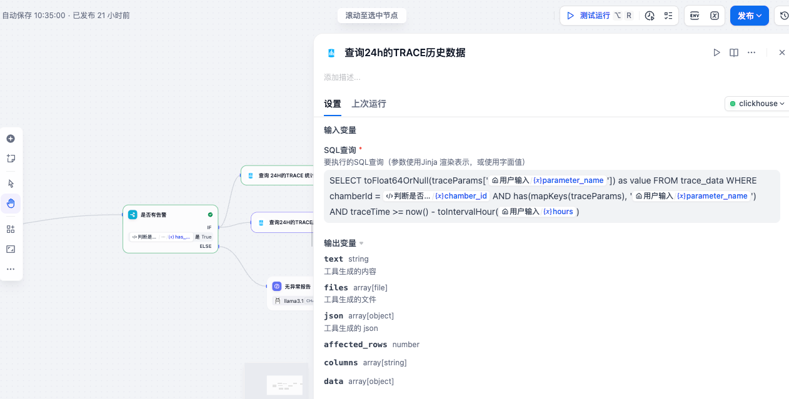
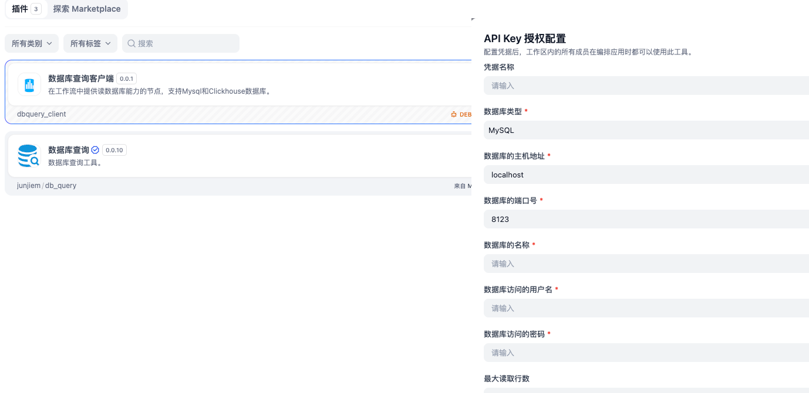

# DB-Query-Client

<p>
<a href="https://github.com/colley/dbquery-client"></a>
<a href="https://marketplace.dify.ai/plugins/colley/dbquery-client"></a>
</p>


**简体中文** | [English](./README.md) 

[DB-Query-Client](https://github.com/colley/dbquery-client) 是为 Dify 工作流设计的插件工具，提供数据库操作节点。目前支持 Mysql、Clickhouse 数据库。



## 特性
- 通过 Dify 的 `credentials_for_provider` 机制安全管理数据库连接信息。
- 支持参数化执行 `SELECT` 不支持`INSERT`、`DELETE`等DML语句。
- 提供动态 SQL 生成及条件逻辑支持。


## 安装
要在 Dify 工作流中使用 `DB-Query-Client`：
1. 通过 Dify [插件市场](https://marketplace.dify.ai/plugins/colley/dbquery-client) 安装插件，或从 [发布页面](https://github.com/colley/dbquery-client/releases) 手动下载版本。
2. 在 Dify 的 `插件 -> 授权` 设置中配置 Mysql、Clickhouse 凭据。



## 节点输出

### 查询执行
对于 `SELECT` 语句，节点返回：
- **`data`**: 查询结果数据的列表，第一维按行排列，第二维按列排列。
- **`columns`**: 结果集的列名。
- **`json[0].data`**: 默认的json返回值获取查询结果，元素是以列名为键的字典对象。

**示例输出：**
```json
{
    "data": [
        ["row0_value0", "row0_value1", "row0_value2"],
        ["row1_value0", "row1_value1", "row1_value2"],
        ["row2_value0", "row2_value1", "row2_value2"]
    ],
    "columns": ["column0", "column1", "column2"],
    "json": [
        {
            "data": [
                {
                    "column0": "value0",
                    "column1": "value1",
                    "column2": "value2"
                }
            ]
        }
    ]
}
```

### 更新执行，暂不支持
对于 `INSERT`、`UPDATE` 或 `DELETE` 语句，节点返回：
- **`affected_rows`**: 受影响的行数。

**示例输出：**
```json
{
    "affected_rows": 2
}
```

## 限制
- 目前仅支持 Mysql、Clickhouse 数据库。
- 动态 SQL 依赖 Jinja2 语法，可能需要用户熟悉模板语言。

## 贡献指南
欢迎贡献代码！参与步骤如下：
1. Fork 本仓库。
2. 创建功能分支（`git checkout -b feature/your-feature`）。
3. 提交更改（`git commit -m "添加您的功能"`）。
4. 推送分支（`git push origin feature/your-feature`）。
5. 提交 Pull Request。

请确保代码遵循项目风格指南并包含适当的测试。

## 许可证
本项目采用 Apache License 2.0 发布。详情请参阅 `LICENSE` 文件。

## 联系方式
如有问题或需要支持，请在仓库中提交 issue。
